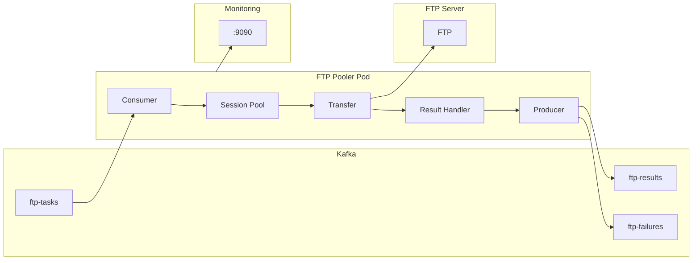

# FTP Pooler

대량의 파일을 FTP 프로토콜을 통해 복사하는 고성능 분산 시스템

## 프로젝트 개요

- **처리량**: 하루 수백만 파일
- **파일 크기**: 수백 KB ~ 수 MB
- **전송 방향**: Upload 또는 Download (한쪽은 항상 로컬)
- **배포**: Kubernetes StatefulSet (scale-out)
- **상태**: Production Ready (v1.0.0)

## 기술 스택

| 분류 | 기술 |
|------|------|
| 언어 | Python 3.11+ |
| 비동기 | asyncio + aiokafka + aioftp |
| API | FastAPI |
| 로깅 | structlog (JSON structured logging) |
| 메트릭 | prometheus-client |
| 테스트 | pytest + pytest-asyncio (33개 테스트) |
| 컨테이너 | Docker (multi-arch: AMD64/ARM64) |
| 오케스트레이션 | Kubernetes StatefulSet |

## 아키텍처

Kafka에서 작업 메시지를 consume하여 비동기로 FTP 전송을 수행하고, 결과를 Kafka 토픽에 publish합니다.



## 프로젝트 구조

```
ftp-pooler/
├── src/ftp_pooler/       # 메인 소스코드
│   ├── main.py           # 진입점 (Application orchestrator)
│   ├── config/           # 설정 로더
│   │   ├── settings.py   # Pydantic 기반 설정 모델
│   │   └── connections.py # 연결 설정 (INI 파서)
│   ├── kafka/            # Kafka consumer/producer
│   │   ├── consumer.py   # 비동기 메시지 소비
│   │   └── producer.py   # 결과/실패 메시지 발행
│   ├── pool/             # FTP 세션 풀 관리
│   │   ├── manager.py    # SessionPoolManager
│   │   └── session.py    # FTPSession (연결 상태 관리)
│   ├── transfer/         # 전송 엔진
│   │   ├── engine.py     # TransferEngine
│   │   └── task.py       # TransferTask 모델
│   ├── api/              # REST API (FastAPI)
│   │   └── routes.py     # /health, /ready, /metrics
│   └── metrics/          # Prometheus 메트릭
│       └── collector.py  # 커스텀 메트릭 수집기
├── config/               # 설정 파일 예시
│   ├── config.yaml       # 애플리케이션 설정
│   └── connections.ini   # FTP 연결 정보
├── k8s/                  # Kubernetes 매니페스트
│   ├── base/             # 기본 매니페스트
│   │   ├── namespace.yaml
│   │   ├── configmap.yaml
│   │   └── statefulset.yaml
│   └── test/             # 테스트 환경
│       ├── configmap-test.yaml
│       └── ftp-server.yaml  # vsftpd 테스트 서버
├── tests/                # 테스트 코드 (33개)
│   ├── test_config.py    # 설정 테스트
│   ├── test_pool.py      # 세션 풀 테스트
│   ├── test_transfer.py  # 전송 엔진 테스트
│   ├── test_kafka.py     # Kafka 통합 테스트
│   └── test_api.py       # API 테스트
├── docs/                 # 문서
│   ├── ARCHITECTURE.md   # 상세 아키텍처 문서
│   └── TEST_REPORT.md    # 테스트 결과 리포트
├── Dockerfile            # 멀티 아키텍처 빌드
├── requirements.txt      # 프로덕션 의존성
├── requirements-dev.txt  # 개발 의존성
└── pyproject.toml        # 프로젝트 메타데이터
```

## 주요 설정 파일

### config.yaml
```yaml
kafka:
  bootstrap_servers:
    - "kafka:9092"
  consumer_group: "ftp-pooler"
  input_topic: "ftp-tasks"
  result_topic: "ftp-results"
  fail_topic: "ftp-failures"

pool:
  max_sessions_per_pod: 100
  max_sessions_per_connection: 10
  session_timeout_seconds: 300

api:
  host: "0.0.0.0"
  port: 8080

metrics:
  port: 9090
```

### connections.ini (rclone 스타일)
```ini
[remote-ftp]
type = ftp
host = ftp.example.com
port = 21
user = username
pass = password
passive = true

[local]
type = local
base_path = /data/storage
```

## 메시지 형식

### 입력 메시지 (ftp-tasks)
```json
{
  "task_id": "uuid-string",
  "operation": "download",
  "source": {
    "connection_id": "remote-ftp",
    "path": "/remote/file.txt"
  },
  "destination": {
    "connection_id": "local",
    "path": "/data/file.txt"
  },
  "options": {
    "overwrite": true,
    "retry_count": 3
  }
}
```

### 결과 메시지 (ftp-results)
```json
{
  "task_id": "uuid-string",
  "status": "completed",
  "bytes_transferred": 1024,
  "duration_ms": 150,
  "completed_at": "2025-01-15T10:30:00Z"
}
```

## 코딩 컨벤션

- 비동기 함수는 `async def` 사용
- 타입 힌트 필수
- docstring은 Google 스타일
- 로깅은 structlog 사용 (JSON 포맷)
- 테스트 파일은 `test_*.py` 패턴
- Pydantic 모델로 설정/데이터 검증

## 실행 명령어

```bash
# 의존성 설치
pip install -r requirements.txt

# 개발 의존성 설치
pip install -r requirements-dev.txt

# 테스트 실행
pytest

# 특정 테스트 실행
pytest tests/test_pool.py -v

# 커버리지 포함 테스트
pytest --cov=ftp_pooler --cov-report=html

# 애플리케이션 실행
python -m ftp_pooler.main
```

## Kubernetes 배포

```bash
# 네임스페이스 및 기본 리소스 생성
kubectl apply -f k8s/base/

# 테스트 환경 배포
kubectl apply -f k8s/test/

# 상태 확인
kubectl get pods -n ftp-pooler

# 로그 확인
kubectl logs -f ftp-pooler-0 -n ftp-pooler
```

## E2E 테스트

```bash
# Kafka에 테스트 메시지 전송
echo '{"task_id":"test-001","operation":"download","source":{"connection_id":"remote-ftp","path":"/ftpuser/test/sample1.txt"},"destination":{"connection_id":"local","path":"/data/storage/downloaded/sample1.txt"}}' | \
  /opt/kafka/bin/kafka-console-producer.sh \
    --broker-list kafka-broker-0.kafka-broker.kafka:9092 \
    --topic ftp-tasks

# 결과 확인
/opt/kafka/bin/kafka-console-consumer.sh \
  --bootstrap-server kafka-broker-0.kafka-broker.kafka:9092 \
  --topic ftp-results \
  --from-beginning \
  --max-messages 1
```

## Git 워크플로우

각 구현 단계가 완료될 때마다 반드시 다음을 수행합니다:

1. 변경사항 확인: `git status`
2. 스테이징: `git add .`
3. 커밋: 단계별 의미 있는 커밋 메시지 작성
4. 푸시: `git push origin main`

### 커밋 메시지 형식

```
<type>: <description>

<body>

🤖 Generated with [Claude Code](https://claude.com/claude-code)

Co-Authored-By: Claude <noreply@anthropic.com>
```

**Type 종류:**
- `feat`: 새로운 기능
- `fix`: 버그 수정
- `docs`: 문서 변경
- `refactor`: 코드 리팩토링
- `test`: 테스트 추가/수정
- `chore`: 빌드, 설정 등 기타 변경

## 참고 문서

- [아키텍처 문서](docs/ARCHITECTURE.md) - 상세 시스템 아키텍처
- [테스트 리포트](docs/TEST_REPORT.md) - 테스트 결과 및 커버리지
- [README](README.md) - 프로젝트 개요 및 빠른 시작 가이드
