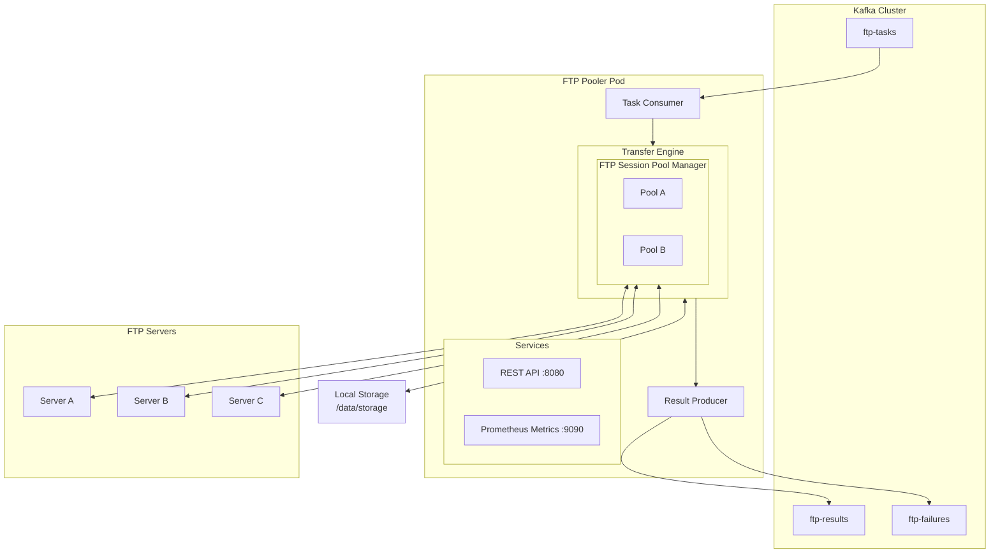

# FTP Pooler

Kafka 기반의 고성능 분산 FTP 파일 전송 시스템

[](https://github.com/nineking424/ftp-pooler)
[](https://www.python.org/)
[](LICENSE)

## 개요

FTP Pooler는 대량의 파일을 FTP 프로토콜을 통해 효율적으로 전송하는 분산 시스템입니다. Kafka를 통해 작업을 분배하고, asyncio 기반의 비동기 처리로 높은 처리량을 달성합니다.

### 주요 특징

- **고성능**: asyncio 기반 비동기 처리로 동시에 다수의 파일 전송
- **확장성**: Kubernetes StatefulSet으로 손쉬운 수평 확장 (scale-out)
- **안정성**: FTP 세션 풀링으로 연결 재사용 및 효율적인 리소스 관리
- **모니터링**: Prometheus 메트릭 및 JSON 구조화 로깅
- **유연성**: 다양한 FTP 서버 연결 지원 (다중 접속 설정)

### 사용 사례

- 하루 수백만 개의 파일 전송
- 파일 크기: 수백 KB ~ 수 MB
- Upload 또는 Download (한쪽은 항상 로컬 스토리지)

---

## 아키텍처



### 데이터 흐름

1. **입력**: Kafka `ftp-tasks` 토픽에서 전송 작업 메시지 수신
2. **처리**: Transfer Engine이 FTP 세션 풀을 통해 파일 전송 실행
3. **출력**:
   - 성공 시: `ftp-results` 토픽으로 결과 전송
   - 실패 시: `ftp-failures` 토픽으로 에러 정보 전송

---

## 기술 스택

| 구분 | 기술 | 버전 |
|------|------|------|
| 언어 | Python | 3.11+ |
| 비동기 | asyncio, aiokafka, aioftp | - |
| API | FastAPI, uvicorn | - |
| 로깅 | structlog (JSON) | - |
| 모니터링 | prometheus-client | - |
| 설정 | Pydantic, PyYAML | - |
| 배포 | Kubernetes StatefulSet | - |
| 테스트 | pytest, pytest-asyncio | - |

---

## 프로젝트 구조

```
ftp-pooler/
├── src/ftp_pooler/           # 메인 소스코드
│   ├── main.py               # 애플리케이션 진입점
│   ├── logging.py            # 로깅 설정
│   ├── config/               # 설정 관리
│   │   ├── settings.py       # 애플리케이션 설정 (YAML)
│   │   └── connections.py    # FTP 접속 정보 (INI)
│   ├── kafka/                # Kafka 통합
│   │   ├── consumer.py       # 작업 메시지 소비
│   │   └── producer.py       # 결과 메시지 발행
│   ├── pool/                 # FTP 세션 풀 관리
│   │   ├── session.py        # FTP 세션 래퍼
│   │   └── manager.py        # 세션 풀 매니저
│   ├── transfer/             # 파일 전송 엔진
│   │   ├── models.py         # 데이터 모델 (Task, Result)
│   │   └── engine.py         # 전송 로직
│   ├── api/                  # REST API
│   │   └── routes.py         # FastAPI 라우트
│   └── metrics/              # Prometheus 메트릭
│       └── prometheus.py     # 메트릭 정의
├── config/                   # 설정 파일 예시
│   ├── config.yaml           # 애플리케이션 설정
│   └── connections.ini       # FTP 접속 정보
├── k8s/                      # Kubernetes 매니페스트
│   ├── base/                 # 기본 매니페스트
│   └── test/                 # 테스트 환경 매니페스트
├── tests/                    # 테스트 코드
│   ├── test_config.py        # 설정 테스트
│   ├── test_pool.py          # 세션 풀 테스트
│   └── test_transfer.py      # 전송 모델 테스트
├── docs/                     # 문서
│   ├── ARCHITECTURE.md       # 아키텍처 상세 문서
│   └── TEST_REPORT.md        # 테스트 결과 레포트
├── Dockerfile                # 컨테이너 이미지 빌드
├── requirements.txt          # 프로덕션 의존성
├── requirements-dev.txt      # 개발 의존성
└── pytest.ini                # pytest 설정
```

---

## 빠른 시작

### 사전 요구사항

- Python 3.11+
- Kafka 클러스터
- (선택) Kubernetes 클러스터

### 설치

```bash
# 저장소 클론
git clone https://github.com/nineking424/ftp-pooler.git
cd ftp-pooler

# 가상환경 생성 및 활성화
python -m venv .venv
source .venv/bin/activate

# 의존성 설치
pip install -r requirements.txt

# 개발 의존성 설치 (테스트 포함)
pip install -r requirements-dev.txt
```

### 설정

#### 1. 애플리케이션 설정 (config/config.yaml)

```yaml
kafka:
  bootstrap_servers:
    - "localhost:9092"
  consumer_group: "ftp-pooler"
  input_topic: "ftp-tasks"
  result_topic: "ftp-results"
  fail_topic: "ftp-failures"

pool:
  max_sessions_per_pod: 100
  max_sessions_per_connection: 10
  session_timeout_seconds: 300

api:
  host: "0.0.0.0"
  port: 8080

metrics:
  port: 9090

logging:
  level: "INFO"
  format: "json"
```

#### 2. FTP 접속 정보 (config/connections.ini)

```ini
[remote-server-a]
type = ftp
host = ftp.example.com
port = 21
user = username
pass = password
passive = true

[local]
type = local
base_path = /data/storage
```

### 실행

```bash
# 환경 변수 설정
export FTP_POOLER_CONFIG=/path/to/config.yaml
export FTP_POOLER_CONNECTIONS=/path/to/connections.ini

# 애플리케이션 실행
python -m ftp_pooler.main
```

### Docker 실행

```bash
# 이미지 빌드
docker build -t ftp-pooler:latest .

# 컨테이너 실행
docker run -d \
  -v /path/to/config.yaml:/etc/ftp-pooler/config.yaml \
  -v /path/to/connections.ini:/etc/ftp-pooler/connections.ini \
  -e FTP_POOLER_CONFIG=/etc/ftp-pooler/config.yaml \
  -e FTP_POOLER_CONNECTIONS=/etc/ftp-pooler/connections.ini \
  -p 8080:8080 \
  -p 9090:9090 \
  ftp-pooler:latest
```

---

## Kubernetes 배포

### 사전 요구사항

- Kubernetes 클러스터 (v1.20+)
- Kafka 클러스터 (클러스터 내부 또는 외부)
- kubectl 설정 완료

### 배포

```bash
# 네임스페이스 생성
kubectl create namespace ftp-pooler

# Kafka 토픽 생성 (Kafka 클러스터에서)
kafka-topics.sh --create --topic ftp-tasks --partitions 3 --replication-factor 2
kafka-topics.sh --create --topic ftp-results --partitions 3 --replication-factor 2
kafka-topics.sh --create --topic ftp-failures --partitions 3 --replication-factor 2

# 매니페스트 적용
kubectl apply -f k8s/test/

# 배포 상태 확인
kubectl get pods -n ftp-pooler
```

### 스케일링

```bash
# 레플리카 수 조정
kubectl scale statefulset ftp-pooler -n ftp-pooler --replicas=3
```

---

## API 엔드포인트

| 엔드포인트 | 메서드 | 설명 |
|-----------|--------|------|
| `/health` | GET | 상태 확인 (상세 정보 포함) |
| `/live` | GET | Liveness Probe |
| `/ready` | GET | Readiness Probe |
| `/stats` | GET | 애플리케이션 통계 |
| `/metrics` | GET | Prometheus 메트릭 (포트 9090) |

### 예시 응답

```bash
# Health Check
curl http://localhost:8080/health
```

```json
{
  "status": "healthy",
  "version": "0.1.0"
}
```

```bash
# Statistics
curl http://localhost:8080/stats
```

```json
{
  "running": true,
  "pool": {
    "max_sessions_per_pod": 100,
    "max_sessions_per_connection": 10,
    "total_sessions": 5,
    "pools": {}
  },
  "consumer": {
    "tasks_received": 150
  },
  "transfer": {
    "tasks_in_progress": 2
  }
}
```

---

## 메시지 형식

### 입력 메시지 (ftp-tasks)

```json
{
  "task_id": "uuid-1234-5678",
  "src_id": "remote-server-a",
  "src_path": "/remote/path/file.txt",
  "dst_id": "local",
  "dst_path": "/local/path/file.txt",
  "metadata": {
    "priority": "high",
    "retry_count": 0
  }
}
```

| 필드 | 타입 | 필수 | 설명 |
|------|------|------|------|
| task_id | string | 선택 | 작업 ID (미제공 시 자동 생성) |
| src_id | string | 필수 | 소스 연결 ID (connections.ini) |
| src_path | string | 필수 | 소스 파일 경로 |
| dst_id | string | 필수 | 목적지 연결 ID |
| dst_path | string | 필수 | 목적지 파일 경로 |
| metadata | object | 선택 | 추가 메타데이터 |

### 결과 메시지 (ftp-results / ftp-failures)

```json
{
  "task_id": "uuid-1234-5678",
  "status": "success",
  "src_id": "remote-server-a",
  "src_path": "/remote/path/file.txt",
  "dst_id": "local",
  "dst_path": "/local/path/file.txt",
  "bytes_transferred": 1048576,
  "duration_ms": 1234,
  "timestamp": "2025-11-25T19:00:03.045406+00:00"
}
```

실패 시 추가 필드:

```json
{
  "error_code": "CONNECTION_ERROR",
  "error_message": "Failed to connect to FTP server"
}
```

---

## 테스트

### 단위 테스트

```bash
# 전체 테스트 실행
PYTHONPATH=src pytest tests/ -v

# 특정 테스트 파일 실행
PYTHONPATH=src pytest tests/test_config.py -v

# 커버리지 포함
PYTHONPATH=src pytest tests/ -v --cov=ftp_pooler
```

### E2E 테스트

Kubernetes 환경에서 E2E 테스트:

```bash
# 테스트 메시지 전송
echo '{"task_id":"test-001","src_id":"remote-ftp","src_path":"/test.txt","dst_id":"local","dst_path":"/downloaded.txt"}' | \
  kubectl exec -i -n kafka kafka-broker-0 -c broker -- \
  /opt/kafka/bin/kafka-console-producer.sh --bootstrap-server localhost:9092 --topic ftp-tasks

# 결과 확인
kubectl exec -n kafka kafka-broker-0 -c broker -- \
  /opt/kafka/bin/kafka-console-consumer.sh --bootstrap-server localhost:9092 --topic ftp-results --from-beginning --max-messages 1
```

---

## 모니터링

### Prometheus 메트릭

| 메트릭 | 타입 | 설명 |
|--------|------|------|
| ftp_pooler_tasks_total | Counter | 처리된 총 작업 수 |
| ftp_pooler_tasks_success_total | Counter | 성공한 작업 수 |
| ftp_pooler_tasks_failed_total | Counter | 실패한 작업 수 |
| ftp_pooler_bytes_transferred_total | Counter | 전송된 총 바이트 |
| ftp_pooler_transfer_duration_seconds | Histogram | 전송 소요 시간 |
| ftp_pooler_active_sessions | Gauge | 현재 활성 FTP 세션 수 |

### Grafana 대시보드

Prometheus 메트릭을 Grafana에서 시각화할 수 있습니다.

```yaml
# Kubernetes Pod Annotations
annotations:
  prometheus.io/scrape: "true"
  prometheus.io/port: "9090"
  prometheus.io/path: "/metrics"
```

---

## 에러 코드

| 코드 | 설명 |
|------|------|
| INVALID_CONFIG | 잘못된 설정 (소스/목적지 모두 로컬 또는 모두 원격) |
| FILE_NOT_FOUND | 소스 파일을 찾을 수 없음 |
| CONNECTION_ERROR | FTP 서버 연결 실패 |
| IO_ERROR | 파일 읽기/쓰기 오류 |
| UNKNOWN_ERROR | 예상치 못한 오류 |

---

## 문서

- [아키텍처 상세 문서](docs/ARCHITECTURE.md)
- [테스트 결과 레포트](docs/TEST_REPORT.md)
- [개발 가이드](CLAUDE.md)

---

## 변경 이력

### v0.2.1 (2025-11-25)
- Kubernetes 테스트 환경 구축
- API 서버 시작 버그 수정
- Kafka consumer 빈 메시지 처리 개선
- Settings 환경 변수 로딩 수정
- 종합 테스트 레포트 추가

### v0.1.0 (2025-11-25)
- 초기 릴리스
- 핵심 기능 구현 (Kafka 통합, FTP 세션 풀, 전송 엔진)
- REST API 및 Prometheus 메트릭
- Kubernetes 배포 지원

---

## 라이선스

MIT License

---

## 기여

1. Fork the repository
2. Create your feature branch (`git checkout -b feature/amazing-feature`)
3. Commit your changes (`git commit -m 'Add some amazing feature'`)
4. Push to the branch (`git push origin feature/amazing-feature`)
5. Open a Pull Request
