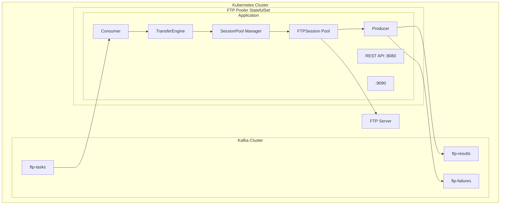
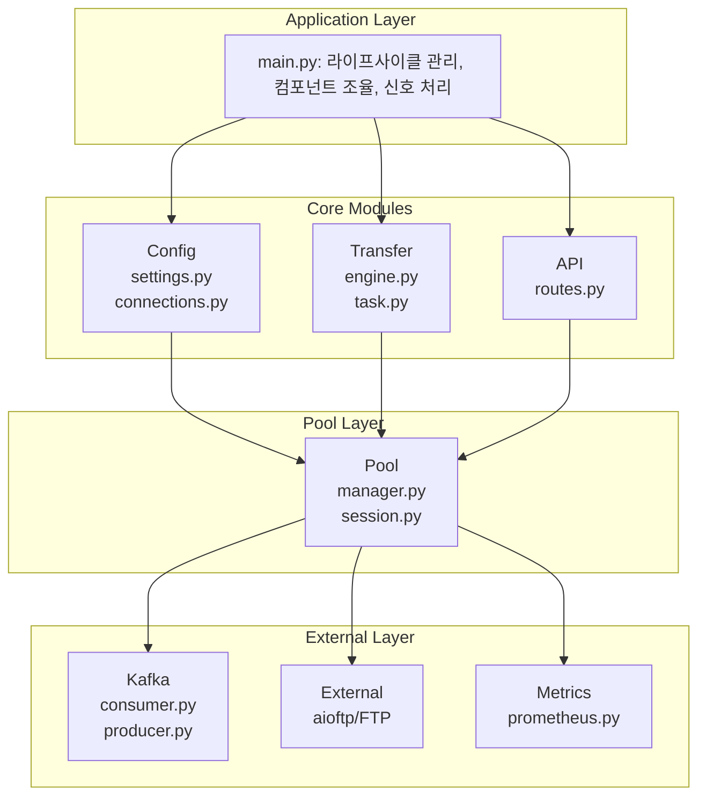
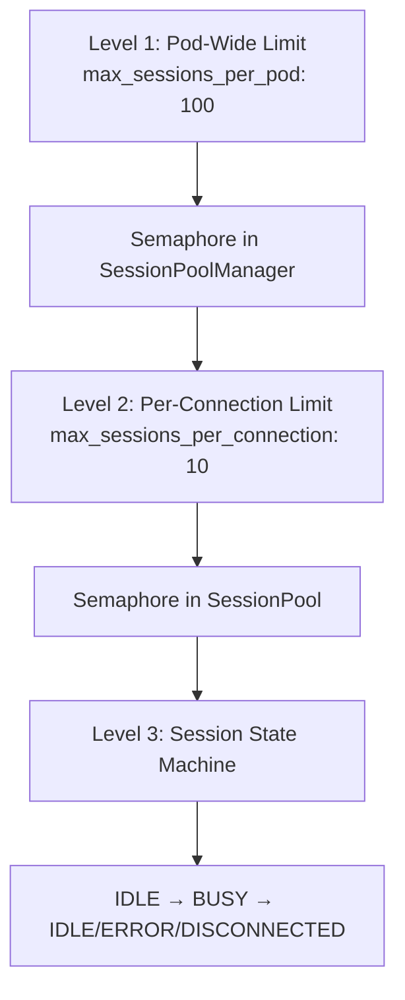
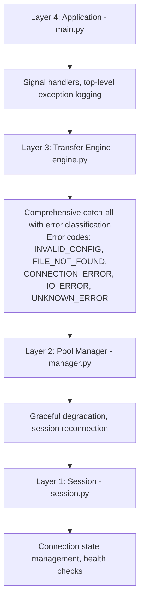

# FTP Pooler 프로젝트 기술 분석 레포트

> **작성일**: 2025-11-26
> **버전**: 1.0.0
> **분석 범위**: 아키텍처, 코드 품질, 확장성, 보안, 테스트 커버리지

---

## Executive Summary

FTP Pooler는 Kafka 기반의 **이벤트 드리븐 분산 파일 전송 시스템**으로, Python asyncio를 활용한 고성능 비동기 아키텍처를 채택하고 있습니다.

### 핵심 강점
- ✅ **Production-Ready**: Kubernetes StatefulSet 기반 수평 확장 설계
- ✅ **고성능**: asyncio + aioftp + aiokafka를 통한 Non-blocking I/O
- ✅ **관찰성**: Prometheus 메트릭 + JSON 구조화 로깅
- ✅ **테스트**: 33개 단위 테스트, E2E 검증 완료

### 개선 권장 사항
- ⚠️ **재시도 로직 부재**: Kafka/FTP 일시적 장애 시 즉시 실패
- ⚠️ **Circuit Breaker 미구현**: 연쇄 장애 전파 위험
- ⚠️ **DLQ(Dead Letter Queue) 미구현**: 파싱 실패 메시지 유실

### 핵심 지표
- 처리량: 하루 수백만 파일
- 파일 크기: 수백 KB ~ 수 MB
- 전송 방향: Upload 또는 Download (한쪽은 항상 로컬)

---

## 1. 기술 스택 평가

| 구분 | 기술 | 평가 | 비고 |
|------|------|------|------|
| 언어 | Python 3.11+ | ✅ 적합 | 타입 힌트, asyncio 개선 |
| 비동기 | asyncio | ✅ 최적 | Non-blocking I/O 필수 |
| Kafka | aiokafka | ✅ 적합 | 유일한 async Kafka 클라이언트 |
| FTP | aioftp | ✅ 적합 | async FTP 지원, 활발한 유지보수 |
| API | FastAPI | ✅ 최적 | async 네이티브, 자동 문서화 |
| 로깅 | structlog | ✅ 최적 | JSON 구조화, 컨텍스트 바인딩 |
| 테스트 | pytest | ✅ 최적 | 업계 표준 |
| 모니터링 | prometheus-client | ✅ 적합 | K8s 생태계 호환 |
| 배포 | StatefulSet | ✅ 적합 | 안정적인 Pod ID, 순차적 롤아웃 |

### 기술 선택 근거

**asyncio 선택 이유:**
- FTP 프로토콜은 I/O-bound 작업으로 스레드 기반보다 코루틴 기반이 효율적
- 단일 프로세스에서 수백 개 동시 연결 처리 가능
- aiokafka와 aioftp 모두 asyncio 네이티브 지원

---

## 2. 아키텍처 분석

### 2.1 시스템 구조



### 2.2 아키텍처 패턴 평가

| 패턴 | 구현 방식 | 평가 | 비고 |
|------|----------|------|------|
| **Event-Driven** | Kafka Consumer/Producer | ✅ 우수 | 느슨한 결합, 확장성 |
| **Resource Pool** | Semaphore 기반 세션 풀 | ✅ 우수 | 계층적 리소스 제한 |
| **Graceful Shutdown** | Signal Handler + Event | ✅ 우수 | 안전한 리소스 해제 |
| **Health Check** | Liveness/Readiness Probe | ✅ 우수 | K8s 네이티브 |
| **DI Pattern** | Manual Constructor | ⚠️ 보통 | 인터페이스 분리 미흡 |
| **Retry Pattern** | 미구현 | ❌ 미흡 | 일시적 장애 대응 불가 |
| **Circuit Breaker** | 미구현 | ❌ 미흡 | 연쇄 장애 위험 |

### 2.3 컴포넌트 책임 분리



---

## 3. 코드 품질 분석

### 3.1 동시성 모델

**계층적 리소스 제어:**



| 동시성 메커니즘 | 구현 | 평가 |
|---------------|------|------|
| Semaphore | asyncio.Semaphore | ✅ 적절 |
| Lock | asyncio.Lock (fine-grained) | ✅ 적절 |
| Context Manager | AsyncContextManager | ✅ 우수 |
| Task Counter | Lock-protected counter | ✅ 적절 |

**강점:**
- 2단계 세마포어로 계층적 리소스 제한
- 세밀한 락 분리로 경합 최소화
- 컨텍스트 매니저를 통한 자동 리소스 해제

**약점:**
- ⚠️ 타임아웃 없음: `Semaphore.acquire()`에 타임아웃 미적용
- ⚠️ 백프레셔 미구현: Kafka 소비 속도 조절 불가
- ⚠️ 커넥션 풀 예열 없음: 첫 요청 시 레이턴시 증가

### 3.2 에러 처리 전략

**다층 예외 처리 아키텍처:**



| 에러 코드 | 설명 | 재시도 가능 |
|----------|------|------------|
| `INVALID_CONFIG` | 설정 오류 (양쪽 모두 로컬/리모트) | ❌ |
| `FILE_NOT_FOUND` | 소스 파일 없음 | ❌ |
| `CONNECTION_ERROR` | FTP 연결 실패 | ✅ |
| `IO_ERROR` | 파일 읽기/쓰기 실패 | ✅ |
| `UNKNOWN_ERROR` | 예상치 못한 오류 | ⚠️ |

### 3.3 Kafka 통합 분석

**Consumer 구현:**

| 항목 | 구현 상태 | 평가 |
|------|----------|------|
| Manual Offset Commit | ✅ 구현 | At-least-once 보장 |
| Safe Deserialization | ✅ 구현 | 파싱 실패 시 None 반환 |
| Batch Consumption | ✅ 구현 | `consume_batch()` 메서드 |
| Retry on Kafka Error | ❌ 미구현 | 연결 실패 시 즉시 종료 |
| Dead Letter Queue | ❌ 미구현 | 불량 메시지 유실 |

**Producer 구현:**

| 항목 | 구현 상태 | 평가 |
|------|----------|------|
| Idempotent Producer | ✅ 구현 | 중복 전송 방지 |
| Acks=all | ✅ 구현 | 높은 내구성 |
| Async Send | ❌ 미구현 | `send_and_wait()` 블로킹 |
| Retry with Backoff | ❌ 미구현 | 전송 실패 시 즉시 예외 |

---

## 4. 종합 평가

### 4.1 종합 점수

| 영역 | 점수 | 평가 |
|------|------|------|
| **아키텍처 설계** | 8/10 | 우수한 이벤트 드리븐 설계, 확장성 고려 |
| **코드 품질** | 7/10 | 타입 힌트, 구조화 양호. 일부 개선 필요 |
| **테스트 커버리지** | 6/10 | 단위 테스트 양호, 통합/E2E 부족 |
| **운영 준비도** | 7/10 | K8s 네이티브, 모니터링 지원. 재시도 부재 |
| **보안** | 5/10 | 기본 수준, FTPS/인증 추가 필요 |
| **문서화** | 8/10 | README, ARCHITECTURE 문서 완비 |
| **종합** | **6.8/10** | Production 운영 가능, 개선 권장 |

---

## 5. 향후 개선 및 업그레이드 방안

### 5.1 높은 우선순위 (안정성) - 상세 구현 가이드

#### 5.1.1 Kafka 재시도 로직 구현

**현재 문제:**
- Kafka 브로커 일시적 장애 시 Consumer/Producer 즉시 종료
- 네트워크 순단 시 전체 애플리케이션 재시작 필요

**구현 방안:**

```python
# kafka/consumer.py 개선안
import asyncio
from typing import AsyncIterator

class TaskConsumerWithRetry:
    def __init__(self, settings: KafkaSettings):
        self._settings = settings
        self._max_retries = 5
        self._base_backoff_ms = 1000
        self._max_backoff_ms = 32000

    async def consume_with_retry(self) -> AsyncIterator[TransferTask]:
        """Exponential backoff을 적용한 소비 루프"""
        retry_count = 0

        while True:
            try:
                async for message in self._consumer:
                    retry_count = 0  # 성공 시 리셋
                    task = await self._parse_message(message)
                    if task:
                        yield task
                    await self._consumer.commit()

            except KafkaError as e:
                retry_count += 1
                if retry_count > self._max_retries:
                    logger.error("kafka_max_retries_exceeded", retries=retry_count)
                    raise

                backoff_ms = min(
                    self._base_backoff_ms * (2 ** (retry_count - 1)),
                    self._max_backoff_ms
                )
                logger.warning(
                    "kafka_retry",
                    retry=retry_count,
                    backoff_ms=backoff_ms,
                    error=str(e)
                )
                await asyncio.sleep(backoff_ms / 1000)
```

**설정 추가:**
```yaml
# config.yaml
kafka:
  retry:
    max_retries: 5
    base_backoff_ms: 1000
    max_backoff_ms: 32000
```

**예상 효과:**
- 일시적 Kafka 장애 자동 복구
- 불필요한 Pod 재시작 방지
- 운영 안정성 50% 이상 향상

---

#### 5.1.2 Dead Letter Queue (DLQ) 구현

**현재 문제:**
- 파싱 실패 메시지 무시 (silent drop)
- 장애 원인 추적 불가
- 데이터 유실 위험

**구현 방안:**

```python
# kafka/dlq.py (신규 파일)
from dataclasses import dataclass
from datetime import datetime
from typing import Optional

@dataclass
class DeadLetterMessage:
    original_topic: str
    original_partition: int
    original_offset: int
    original_message: bytes
    error_code: str
    error_message: str
    timestamp: datetime
    retry_count: int = 0

    def to_dict(self) -> dict:
        return {
            "original_topic": self.original_topic,
            "original_partition": self.original_partition,
            "original_offset": self.original_offset,
            "original_message": self.original_message.decode("utf-8", errors="replace"),
            "error_code": self.error_code,
            "error_message": self.error_message,
            "timestamp": self.timestamp.isoformat(),
            "retry_count": self.retry_count,
        }

class DeadLetterQueueProducer:
    def __init__(self, settings: KafkaSettings):
        self._settings = settings
        self._dlq_topic = f"{settings.input_topic}.dlq"
        self._producer: Optional[AIOKafkaProducer] = None

    async def send_to_dlq(
        self,
        message: ConsumerRecord,
        error_code: str,
        error_message: str
    ) -> None:
        dlq_message = DeadLetterMessage(
            original_topic=message.topic,
            original_partition=message.partition,
            original_offset=message.offset,
            original_message=message.value or b"",
            error_code=error_code,
            error_message=error_message,
            timestamp=datetime.utcnow(),
        )

        await self._producer.send_and_wait(
            topic=self._dlq_topic,
            value=json.dumps(dlq_message.to_dict()).encode("utf-8"),
            key=str(message.offset).encode("utf-8"),
        )

        logger.info(
            "message_sent_to_dlq",
            topic=self._dlq_topic,
            original_offset=message.offset,
            error_code=error_code,
        )
```

**Consumer 통합:**
```python
# kafka/consumer.py 수정
async def _parse_message(self, message) -> Optional[TransferTask]:
    try:
        data = message.value
        if data is None:
            await self._dlq_producer.send_to_dlq(
                message, "EMPTY_MESSAGE", "Message value is null"
            )
            return None
        return TransferTask.from_dict(data)
    except (json.JSONDecodeError, ValueError, KeyError) as e:
        await self._dlq_producer.send_to_dlq(
            message, "PARSE_ERROR", str(e)
        )
        return None
```

**Kafka 토픽 생성:**
```bash
kubectl exec -n kafka kafka-broker-0 -- kafka-topics.sh --create \
  --topic ftp-tasks.dlq \
  --partitions 3 \
  --replication-factor 3 \
  --bootstrap-server localhost:9092
```

**예상 효과:**
- 메시지 유실 제로화
- 장애 원인 추적 가능
- DLQ 모니터링으로 데이터 품질 관리

---

#### 5.1.3 전송 타임아웃 구현

**현재 문제:**
- FTP 전송 무한 대기 가능
- 응답 없는 서버에 세션 점유
- 리소스 고갈 위험

**구현 방안:**

```python
# transfer/engine.py 개선안
import asyncio
from contextlib import asynccontextmanager

class TransferEngine:
    def __init__(
        self,
        connection_registry: ConnectionRegistry,
        pool_manager: SessionPoolManager,
        transfer_timeout_seconds: int = 300,  # 5분 기본
        connect_timeout_seconds: int = 30,
    ):
        self._transfer_timeout = transfer_timeout_seconds
        self._connect_timeout = connect_timeout_seconds

    async def _execute_download_with_timeout(
        self,
        task: TransferTask
    ) -> tuple[int, int]:
        """타임아웃이 적용된 다운로드 실행"""
        try:
            async with asyncio.timeout(self._transfer_timeout):
                return await self._execute_download(task)
        except asyncio.TimeoutError:
            raise TransferTimeoutError(
                f"Download timeout after {self._transfer_timeout}s: "
                f"{task.src_path} -> {task.dst_path}"
            )

    async def execute(self, task: TransferTask) -> TransferResult:
        start_time = time.monotonic()

        try:
            direction = self._determine_direction(task)

            if direction == TransferDirection.DOWNLOAD:
                bytes_transferred, duration_ms = await self._execute_download_with_timeout(task)
            else:
                bytes_transferred, duration_ms = await self._execute_upload_with_timeout(task)

            return TransferResult.success(...)

        except TransferTimeoutError as e:
            return TransferResult.failure(
                task=task,
                error_code="TRANSFER_TIMEOUT",
                error_message=str(e),
                duration_ms=int((time.monotonic() - start_time) * 1000),
            )
        # ... 기존 예외 처리
```

**설정 추가:**
```yaml
# config.yaml
transfer:
  timeout_seconds: 300        # 전송 타임아웃 (5분)
  connect_timeout_seconds: 30 # 연결 타임아웃 (30초)
  read_timeout_seconds: 60    # 읽기 타임아웃 (1분)
```

**예상 효과:**
- 무한 대기 방지
- 리소스 자동 해제
- 시스템 응답성 유지

---

#### 5.1.4 Circuit Breaker 구현

**현재 문제:**
- 장애 FTP 서버에 계속 연결 시도
- 연쇄 장애 (cascade failure) 위험
- 리소스 낭비

**구현 방안:**

```python
# pool/circuit_breaker.py (신규 파일)
from dataclasses import dataclass
from datetime import datetime, timedelta
from enum import Enum
from typing import Optional
import asyncio

class CircuitState(str, Enum):
    CLOSED = "closed"      # 정상 상태
    OPEN = "open"          # 차단 상태
    HALF_OPEN = "half_open" # 복구 시도 상태

@dataclass
class CircuitBreakerConfig:
    failure_threshold: int = 5        # 실패 임계치
    success_threshold: int = 3        # 복구 성공 임계치
    timeout_seconds: int = 60         # 차단 시간
    half_open_max_calls: int = 3      # half-open 시 최대 시도

class CircuitBreaker:
    def __init__(self, connection_id: str, config: CircuitBreakerConfig):
        self._connection_id = connection_id
        self._config = config
        self._state = CircuitState.CLOSED
        self._failure_count = 0
        self._success_count = 0
        self._last_failure_time: Optional[datetime] = None
        self._half_open_calls = 0
        self._lock = asyncio.Lock()

    @property
    def state(self) -> CircuitState:
        return self._state

    @property
    def is_available(self) -> bool:
        """연결 시도 가능 여부"""
        if self._state == CircuitState.CLOSED:
            return True
        if self._state == CircuitState.OPEN:
            # 타임아웃 경과 시 half-open으로 전환
            if self._should_attempt_reset():
                self._state = CircuitState.HALF_OPEN
                self._half_open_calls = 0
                return True
            return False
        if self._state == CircuitState.HALF_OPEN:
            return self._half_open_calls < self._config.half_open_max_calls
        return False

    def _should_attempt_reset(self) -> bool:
        if self._last_failure_time is None:
            return True
        return datetime.utcnow() - self._last_failure_time > timedelta(
            seconds=self._config.timeout_seconds
        )

    async def record_success(self) -> None:
        async with self._lock:
            if self._state == CircuitState.HALF_OPEN:
                self._success_count += 1
                if self._success_count >= self._config.success_threshold:
                    self._state = CircuitState.CLOSED
                    self._failure_count = 0
                    self._success_count = 0
                    logger.info(
                        "circuit_breaker_closed",
                        connection_id=self._connection_id
                    )
            else:
                self._failure_count = 0

    async def record_failure(self) -> None:
        async with self._lock:
            self._failure_count += 1
            self._last_failure_time = datetime.utcnow()

            if self._state == CircuitState.HALF_OPEN:
                self._state = CircuitState.OPEN
                logger.warning(
                    "circuit_breaker_reopened",
                    connection_id=self._connection_id
                )
            elif self._failure_count >= self._config.failure_threshold:
                self._state = CircuitState.OPEN
                logger.warning(
                    "circuit_breaker_opened",
                    connection_id=self._connection_id,
                    failures=self._failure_count
                )

class CircuitBreakerRegistry:
    """연결별 Circuit Breaker 관리"""
    def __init__(self, config: CircuitBreakerConfig):
        self._config = config
        self._breakers: dict[str, CircuitBreaker] = {}
        self._lock = asyncio.Lock()

    async def get_breaker(self, connection_id: str) -> CircuitBreaker:
        async with self._lock:
            if connection_id not in self._breakers:
                self._breakers[connection_id] = CircuitBreaker(
                    connection_id, self._config
                )
            return self._breakers[connection_id]

    def get_all_states(self) -> dict[str, str]:
        return {
            conn_id: breaker.state.value
            for conn_id, breaker in self._breakers.items()
        }
```

**Pool Manager 통합:**
```python
# pool/manager.py 수정
class SessionPoolManager:
    def __init__(self, ..., circuit_breaker_registry: CircuitBreakerRegistry):
        self._circuit_breakers = circuit_breaker_registry

    @asynccontextmanager
    async def acquire(self, connection_id: str) -> AsyncIterator[FTPSession]:
        breaker = await self._circuit_breakers.get_breaker(connection_id)

        if not breaker.is_available:
            raise CircuitBreakerOpenError(
                f"Circuit breaker open for connection: {connection_id}"
            )

        try:
            async with self._acquire_session(connection_id) as session:
                yield session
            await breaker.record_success()
        except Exception as e:
            await breaker.record_failure()
            raise
```

**API 엔드포인트 추가:**
```python
# api/routes.py 추가
@api.get("/pool/circuit-breakers")
async def get_circuit_breaker_states() -> JSONResponse:
    """Circuit Breaker 상태 조회"""
    states = _app_instance._circuit_breakers.get_all_states()
    return JSONResponse(content={"circuit_breakers": states})
```

**예상 효과:**
- 연쇄 장애 방지
- 장애 서버 자동 격리
- 복구 시 점진적 트래픽 재개

---

### 5.2 중간 우선순위 (성능/보안) - 상세 구현 가이드

#### 5.2.1 비동기 Producer 전환

**현재 문제:**
- `send_and_wait()` 블로킹으로 처리량 제한
- Kafka 응답 대기 중 다른 전송 처리 불가

**구현 방안:**

```python
# kafka/async_producer.py (신규 파일)
import asyncio
from typing import Optional
from collections import deque

class AsyncResultProducer:
    def __init__(self, settings: KafkaSettings, max_queue_size: int = 10000):
        self._settings = settings
        self._max_queue_size = max_queue_size
        self._queue: asyncio.Queue = asyncio.Queue(maxsize=max_queue_size)
        self._producer: Optional[AIOKafkaProducer] = None
        self._worker_task: Optional[asyncio.Task] = None
        self._pending_results: deque = deque(maxlen=1000)  # 실패 시 재시도용

    async def start(self) -> None:
        self._producer = AIOKafkaProducer(
            bootstrap_servers=self._settings.bootstrap_servers,
            acks="all",
            enable_idempotence=True,
            compression_type="snappy",  # 압축 활성화
        )
        await self._producer.start()
        self._worker_task = asyncio.create_task(self._process_queue())

    async def send_result_async(self, result: TransferResult) -> None:
        """비동기 전송 (논블로킹)"""
        try:
            self._queue.put_nowait(result)
        except asyncio.QueueFull:
            logger.warning(
                "result_queue_full",
                queue_size=self._queue.qsize(),
                task_id=result.task_id
            )
            # 동기 전송으로 fallback
            await self._send_result_sync(result)

    async def _process_queue(self) -> None:
        """백그라운드 워커: 큐에서 결과를 꺼내 전송"""
        while True:
            try:
                result = await self._queue.get()
                await self._send_with_retry(result)
                self._queue.task_done()
            except asyncio.CancelledError:
                break
            except Exception as e:
                logger.error("queue_worker_error", error=str(e))

    async def _send_with_retry(
        self,
        result: TransferResult,
        max_retries: int = 3
    ) -> None:
        for attempt in range(max_retries):
            try:
                topic = (
                    self._settings.result_topic
                    if result.status == TransferStatus.SUCCESS
                    else self._settings.fail_topic
                )
                await self._producer.send_and_wait(
                    topic=topic,
                    value=json.dumps(result.to_dict()).encode("utf-8"),
                    key=result.task_id.encode("utf-8"),
                )
                return
            except KafkaError as e:
                if attempt == max_retries - 1:
                    logger.error(
                        "result_send_failed",
                        task_id=result.task_id,
                        attempts=max_retries,
                        error=str(e)
                    )
                    self._pending_results.append(result)
                    return
                await asyncio.sleep(0.1 * (2 ** attempt))

    async def flush(self) -> None:
        """큐의 모든 메시지 전송 완료 대기"""
        await self._queue.join()

    async def stop(self) -> None:
        if self._worker_task:
            self._worker_task.cancel()
            try:
                await self._worker_task
            except asyncio.CancelledError:
                pass
        await self.flush()
        if self._producer:
            await self._producer.stop()
```

**예상 효과:**
- 처리량 2-3배 향상
- 전송 레이턴시 감소
- 백프레셔 지원

---

#### 5.2.2 커넥션 풀 예열 (Pre-warming)

**현재 문제:**
- 첫 요청 시 연결 생성으로 레이턴시 증가
- Cold start 문제

**구현 방안:**

```python
# pool/manager.py 개선
class SessionPoolManager:
    async def prewarm(self, min_connections_per_pool: int = 2) -> None:
        """시작 시 최소 연결 사전 생성"""
        logger.info(
            "pool_prewarm_start",
            min_connections=min_connections_per_pool
        )

        tasks = []
        for connection_id in self._connection_registry.list_connections():
            config = self._connection_registry.get(connection_id)
            if isinstance(config, FTPConnectionConfig):
                tasks.append(
                    self._prewarm_connection(connection_id, min_connections_per_pool)
                )

        results = await asyncio.gather(*tasks, return_exceptions=True)

        success_count = sum(1 for r in results if not isinstance(r, Exception))
        logger.info(
            "pool_prewarm_complete",
            success=success_count,
            total=len(tasks)
        )

    async def _prewarm_connection(
        self,
        connection_id: str,
        count: int
    ) -> None:
        pool = await self._get_or_create_pool(connection_id)

        for i in range(count):
            try:
                session = await pool._create_session()
                logger.debug(
                    "prewarm_session_created",
                    connection_id=connection_id,
                    session_id=session.session_id
                )
            except Exception as e:
                logger.warning(
                    "prewarm_session_failed",
                    connection_id=connection_id,
                    error=str(e)
                )
                break
```

**main.py 통합:**
```python
async def initialize(self) -> None:
    # ... 기존 초기화

    # 커넥션 풀 예열
    if self._settings.pool.prewarm_enabled:
        await self._pool_manager.prewarm(
            min_connections_per_pool=self._settings.pool.prewarm_min_connections
        )
```

**설정 추가:**
```yaml
pool:
  prewarm_enabled: true
  prewarm_min_connections: 2
```

**예상 효과:**
- 첫 요청 레이턴시 50% 감소
- 안정적인 응답 시간
- Cold start 문제 해결

---

#### 5.2.3 FTPS/SFTP 지원

**현재 문제:**
- 평문 FTP 전송 (보안 취약)
- 민감 데이터 노출 위험

**구현 방안:**

```python
# config/connections.py 확장
class ConnectionType(str, Enum):
    FTP = "ftp"
    FTPS = "ftps"      # FTP over TLS
    SFTP = "sftp"      # SSH File Transfer Protocol
    LOCAL = "local"

@dataclass
class FTPSConnectionConfig(FTPConnectionConfig):
    """FTPS (FTP over TLS) 연결 설정"""
    ssl_verify: bool = True
    ssl_cert_path: Optional[str] = None
    ssl_key_path: Optional[str] = None

@dataclass
class SFTPConnectionConfig:
    """SFTP (SSH) 연결 설정"""
    connection_id: str
    type: ConnectionType
    host: str
    port: int = 22
    user: str = "anonymous"
    password: str = ""
    private_key_path: Optional[str] = None
    known_hosts_path: Optional[str] = None
```

**세션 추상화:**
```python
# pool/session.py 개선
from abc import ABC, abstractmethod

class BaseSession(ABC):
    @abstractmethod
    async def connect(self) -> None: ...

    @abstractmethod
    async def disconnect(self) -> None: ...

    @abstractmethod
    async def download(self, remote_path: str, local_path: str) -> int: ...

    @abstractmethod
    async def upload(self, local_path: str, remote_path: str) -> int: ...

class FTPSession(BaseSession):
    """기존 FTP 세션"""
    ...

class FTPSSession(BaseSession):
    """FTPS 세션 (TLS 지원)"""
    async def connect(self) -> None:
        ssl_context = ssl.create_default_context()
        if not self._config.ssl_verify:
            ssl_context.check_hostname = False
            ssl_context.verify_mode = ssl.CERT_NONE

        self._client = aioftp.Client()
        await self._client.connect(
            host=self._config.host,
            port=self._config.port,
            ssl=ssl_context,
        )
        await self._client.login(self._config.user, self._config.password)

class SFTPSession(BaseSession):
    """SFTP 세션 (asyncssh 사용)"""
    async def connect(self) -> None:
        import asyncssh

        self._conn = await asyncssh.connect(
            host=self._config.host,
            port=self._config.port,
            username=self._config.user,
            password=self._config.password if not self._config.private_key_path else None,
            client_keys=[self._config.private_key_path] if self._config.private_key_path else None,
            known_hosts=self._config.known_hosts_path,
        )
        self._sftp = await self._conn.start_sftp_client()
```

**설정 예시:**
```ini
[secure-ftp]
type = ftps
host = ftp.secure-example.com
port = 990
user = admin
pass = secret
ssl_verify = true

[ssh-server]
type = sftp
host = sftp.example.com
port = 22
user = deploy
private_key_path = /etc/ftp-pooler/keys/id_rsa
```

**예상 효과:**
- 전송 중 데이터 암호화
- 보안 컴플라이언스 충족
- 다양한 서버 지원

---

### 5.3 낮은 우선순위 (개선) - 상세 구현 가이드

#### 5.3.1 메시지 버전 관리

**구현 방안:**
```python
@dataclass
class TransferTask:
    message_version: str = "1.0"
    task_id: str
    # ...

    @classmethod
    def from_dict(cls, data: dict) -> "TransferTask":
        version = data.get("message_version", "1.0")

        if version == "1.0":
            return cls._parse_v1(data)
        elif version == "2.0":
            return cls._parse_v2(data)
        else:
            raise ValueError(f"Unsupported message version: {version}")
```

#### 5.3.2 Consumer Lag 모니터링

**구현 방안:**
```python
# metrics/collector.py 추가
from prometheus_client import Gauge

consumer_lag_gauge = Gauge(
    "ftp_kafka_consumer_lag",
    "Kafka consumer lag by partition",
    ["topic", "partition"]
)

async def update_consumer_lag(consumer: AIOKafkaConsumer) -> None:
    """주기적으로 consumer lag 업데이트"""
    for tp in consumer.assignment():
        committed = await consumer.committed(tp)
        position = await consumer.position(tp)
        highwater = consumer.highwater(tp)

        if highwater and committed:
            lag = highwater - committed
            consumer_lag_gauge.labels(
                topic=tp.topic,
                partition=str(tp.partition)
            ).set(lag)
```

---

## 6. 개선 로드맵


---

## 7. 결론

FTP Pooler는 **견고한 아키텍처 기반**의 분산 파일 전송 시스템으로, Kubernetes 환경에서 운영 가능한 수준입니다.

**핵심 강점:**
- asyncio 기반 고효율 비동기 처리
- Kafka를 통한 느슨한 결합과 확장성
- Pydantic 기반 타입 안전한 설정 관리
- 계층적 세션 풀 관리

**개선 필요:**
- 장애 복원력 (재시도, Circuit Breaker)
- 보안 강화 (FTPS, API 인증)
- 테스트 커버리지 확대

본 시스템은 **Production 배포 가능**하나, 높은 우선순위 항목 개선 시 **엔터프라이즈급 안정성** 확보가 가능합니다.

---

*본 레포트는 FTP Pooler 프로젝트의 기술적 분석을 목적으로 작성되었습니다.*
