# FTP Pooler 아키텍처 문서

## 목차

1. [시스템 개요](#1-시스템-개요)
2. [핵심 컴포넌트](#2-핵심-컴포넌트)
3. [데이터 흐름](#3-데이터-흐름)
4. [모듈 상세](#4-모듈-상세)
5. [설정 관리](#5-설정-관리)
6. [확장성](#6-확장성)
7. [에러 처리](#7-에러-처리)
8. [보안 고려사항](#8-보안-고려사항)

---

## 1. 시스템 개요

FTP Pooler는 Kafka 메시지 기반의 비동기 FTP 파일 전송 시스템입니다. 대량의 파일을 효율적으로 전송하기 위해 다음과 같은 설계 원칙을 따릅니다:

### 1.1 설계 원칙

| 원칙 | 설명 |
|------|------|
| **비동기 처리** | asyncio 기반으로 I/O 블로킹 없이 다수의 작업 동시 처리 |
| **연결 재사용** | FTP 세션 풀링으로 연결 오버헤드 최소화 |
| **메시지 기반** | Kafka를 통한 작업 분배로 느슨한 결합 유지 |
| **수평 확장** | StatefulSet으로 Pod 수 조절하여 처리량 확장 |
| **관찰 가능성** | 구조화된 로깅과 메트릭으로 시스템 상태 모니터링 |

### 1.2 시스템 아키텍처 다이어그램

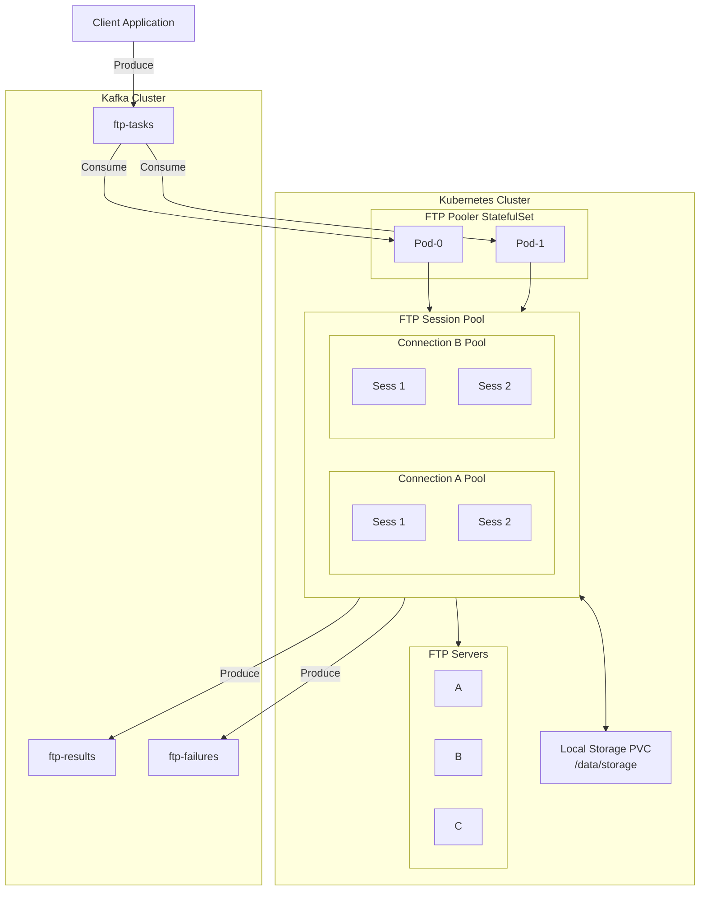

---

## 2. 핵심 컴포넌트

### 2.1 컴포넌트 구조

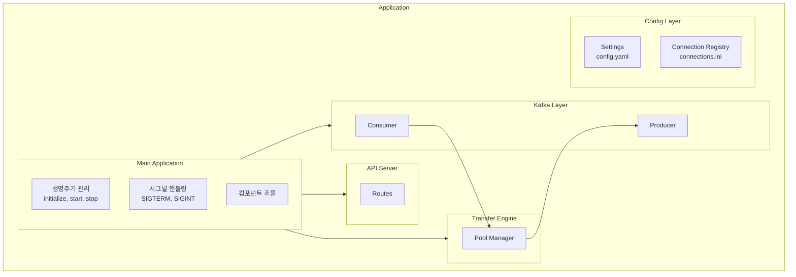

### 2.2 컴포넌트 책임

| 컴포넌트 | 파일 | 책임 |
|----------|------|------|
| **Application** | `main.py` | 생명주기 관리, 시그널 핸들링, 컴포넌트 조율 |
| **TaskConsumer** | `kafka/consumer.py` | Kafka 메시지 소비, 역직렬화, 배치 처리 |
| **ResultProducer** | `kafka/producer.py` | 결과 메시지 발행, 토픽 라우팅 |
| **TransferEngine** | `transfer/engine.py` | 전송 방향 결정, 다운로드/업로드 실행 |
| **SessionPoolManager** | `pool/manager.py` | 연결별 세션 풀 관리, 세션 획득/반환 |
| **FTPSession** | `pool/session.py` | FTP 연결 래퍼, 파일 전송 메서드 |
| **ConnectionRegistry** | `config/connections.py` | FTP/로컬 연결 설정 저장소 |
| **Settings** | `config/settings.py` | 애플리케이션 설정 로딩 |
| **API Routes** | `api/routes.py` | REST API 엔드포인트 |

---

## 3. 데이터 흐름

### 3.1 작업 처리 흐름

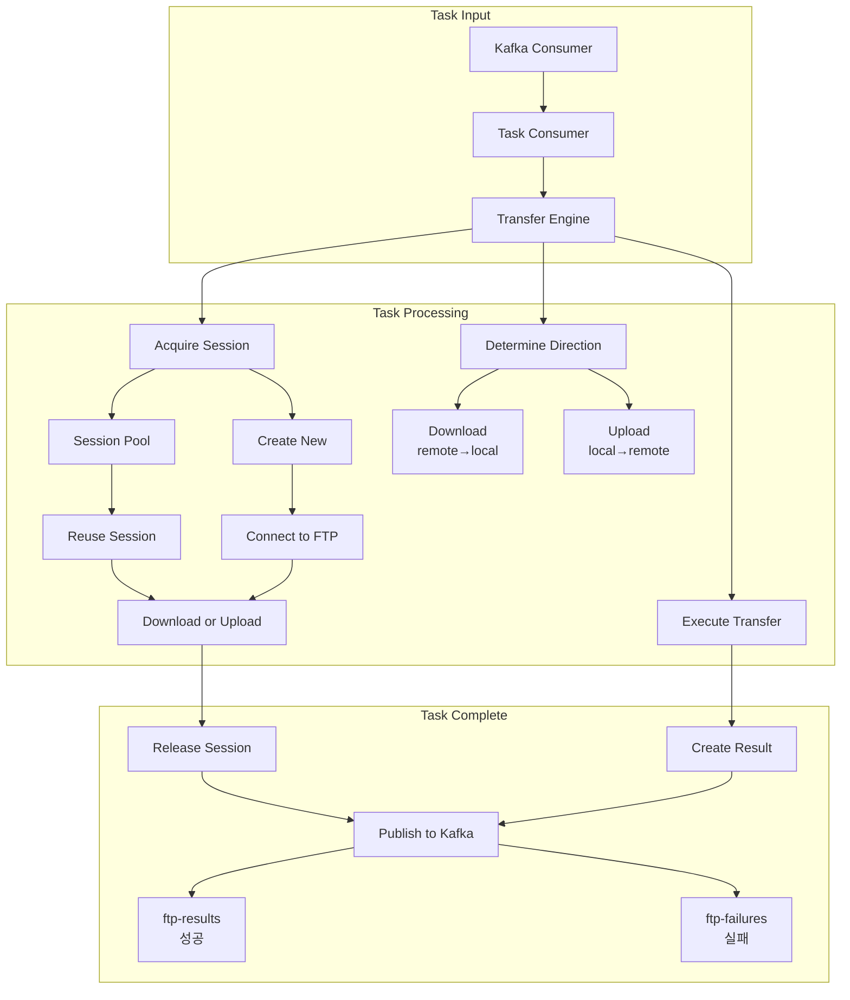

### 3.2 메시지 변환

```python
# 입력: TransferTask
{
    "task_id": "uuid-1234",
    "src_id": "remote-ftp",
    "src_path": "/data/file.txt",
    "dst_id": "local",
    "dst_path": "/storage/file.txt"
}

# 처리 후: TransferResult (성공)
{
    "task_id": "uuid-1234",
    "status": "success",
    "src_id": "remote-ftp",
    "src_path": "/data/file.txt",
    "dst_id": "local",
    "dst_path": "/storage/file.txt",
    "bytes_transferred": 1048576,
    "duration_ms": 1234,
    "timestamp": "2025-11-25T19:00:03.045406+00:00"
}

# 처리 후: TransferResult (실패)
{
    "task_id": "uuid-1234",
    "status": "failed",
    "error_code": "CONNECTION_ERROR",
    "error_message": "Connection refused",
    ...
}
```

---

## 4. 모듈 상세

### 4.1 FTP Session Pool

세션 풀은 FTP 연결을 효율적으로 관리합니다.

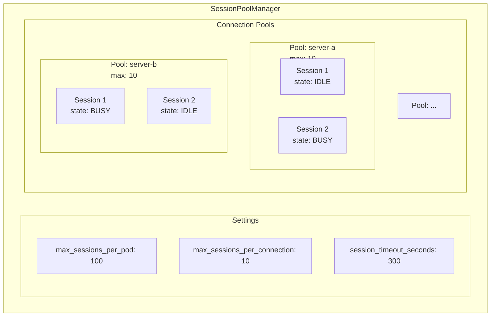

#### 세션 상태 전이

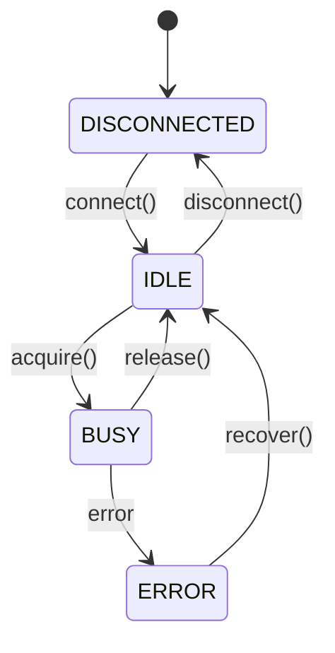

### 4.2 Transfer Engine

전송 엔진은 작업의 방향을 결정하고 실행합니다.

```python
# 방향 결정 로직
def _determine_direction(task):
    src_is_local = registry.get(task.src_id).type == LOCAL
    dst_is_local = registry.get(task.dst_id).type == LOCAL

    if src_is_local and dst_is_local:
        raise ValueError("Both local")
    if not src_is_local and not dst_is_local:
        raise ValueError("Both remote")

    return UPLOAD if src_is_local else DOWNLOAD
```

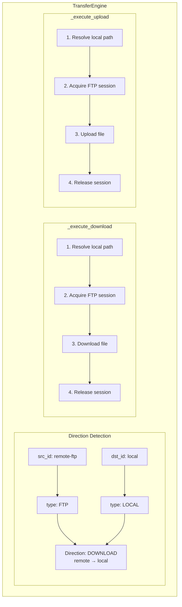

### 4.3 Kafka Integration

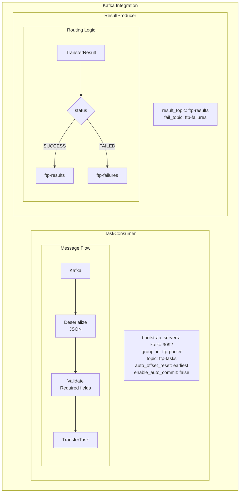

---

## 5. 설정 관리

### 5.1 설정 계층

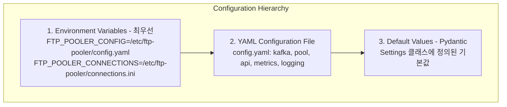

### 5.2 설정 클래스 구조

```python
Settings
├── kafka: KafkaSettings
│   ├── bootstrap_servers: list[str]  # ["localhost:9092"]
│   ├── consumer_group: str           # "ftp-pooler"
│   ├── input_topic: str              # "ftp-tasks"
│   ├── result_topic: str             # "ftp-results"
│   └── fail_topic: str               # "ftp-failures"
│
├── pool: PoolSettings
│   ├── max_sessions_per_pod: int          # 100
│   ├── max_sessions_per_connection: int   # 10
│   └── session_timeout_seconds: int       # 300
│
├── api: ApiSettings
│   ├── host: str   # "0.0.0.0"
│   └── port: int   # 8080
│
├── metrics: MetricsSettings
│   └── port: int   # 9090
│
├── logging: LoggingSettings
│   ├── level: str    # "INFO"
│   └── format: str   # "json"
│
├── config_path: Optional[str]
└── connections_path: Optional[str]
```

### 5.3 연결 레지스트리

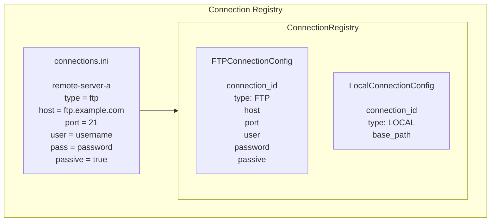

---

## 6. 확장성

### 6.1 수평 확장 (Scale-Out)

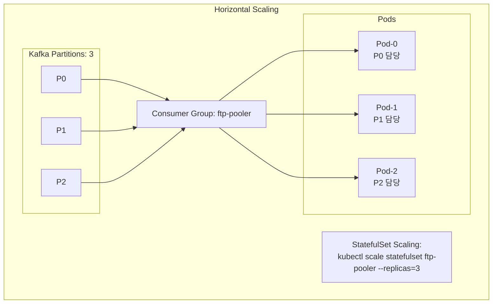

### 6.2 연결별 동시성 제어

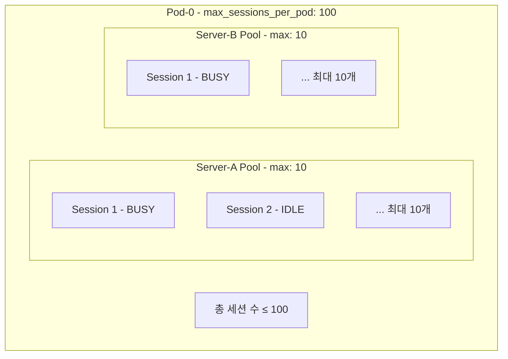

---

## 7. 에러 처리

### 7.1 에러 분류

| 에러 코드 | 분류 | 설명 | 재시도 가능 |
|-----------|------|------|-------------|
| INVALID_CONFIG | 설정 오류 | 소스/목적지 모두 로컬 또는 원격 | X |
| FILE_NOT_FOUND | 파일 오류 | 소스 파일 없음 | X |
| CONNECTION_ERROR | 연결 오류 | FTP 서버 연결 실패 | O |
| IO_ERROR | I/O 오류 | 파일 읽기/쓰기 실패 | O |
| UNKNOWN_ERROR | 기타 오류 | 예상치 못한 오류 | △ |

### 7.2 에러 처리 흐름

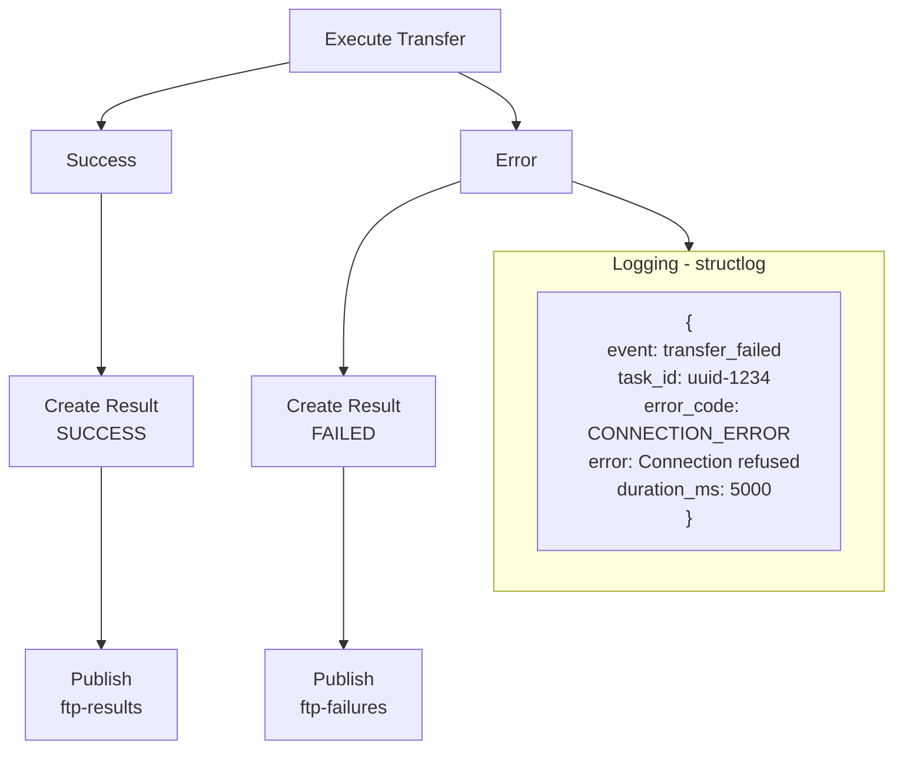

---

## 8. 보안 고려사항

### 8.1 인증 정보 관리

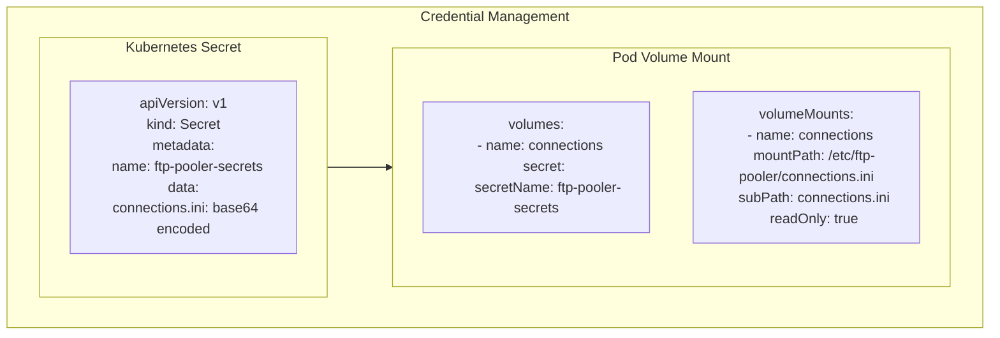

### 8.2 네트워크 보안

- FTP 세션은 패시브 모드 사용 권장
- Kubernetes NetworkPolicy로 Pod 간 통신 제한 가능
- FTP over TLS (FTPS) 지원 예정

### 8.3 컨테이너 보안

```dockerfile
# Non-root 사용자로 실행
RUN addgroup --gid 1000 appgroup && \
    adduser --uid 1000 --gid 1000 --disabled-password appuser

USER appuser

# Read-only 파일시스템 (쓰기는 PVC만)
# securityContext:
#   readOnlyRootFilesystem: true
```

---

## 부록

### A. 클래스 다이어그램

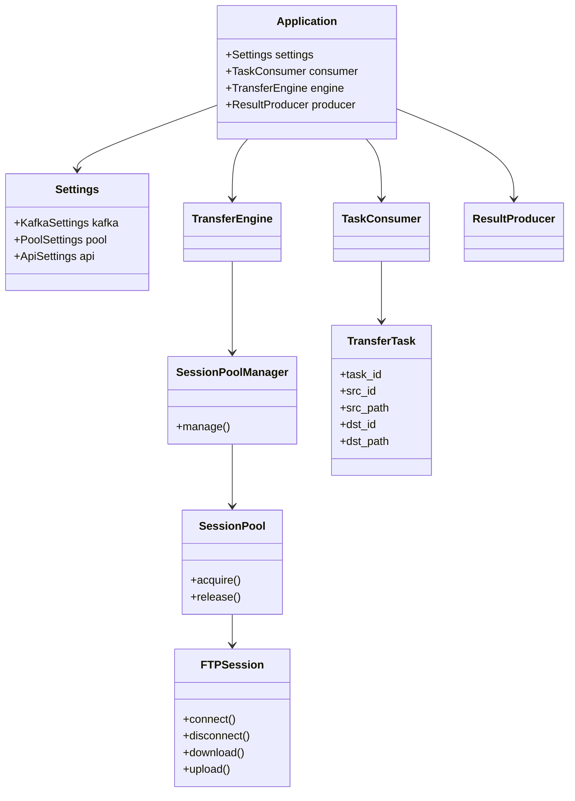

### B. 시퀀스 다이어그램 (파일 다운로드)

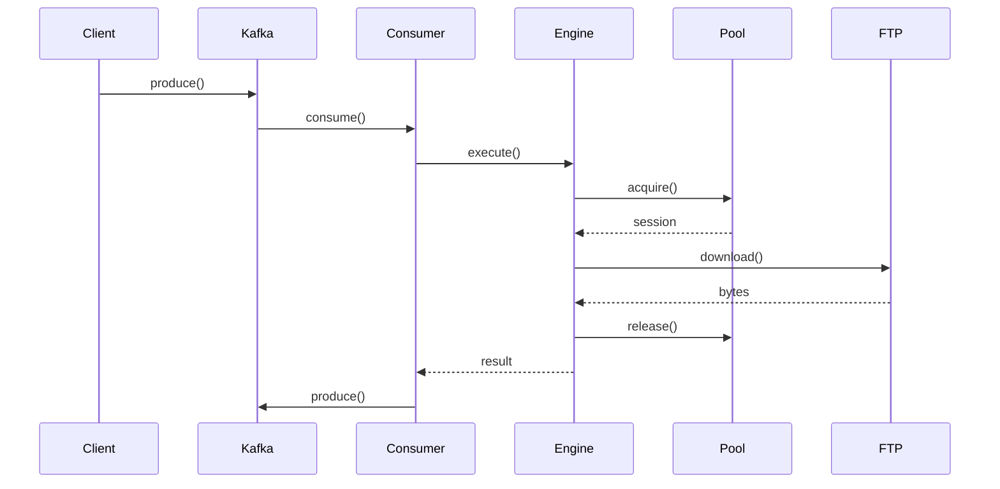
